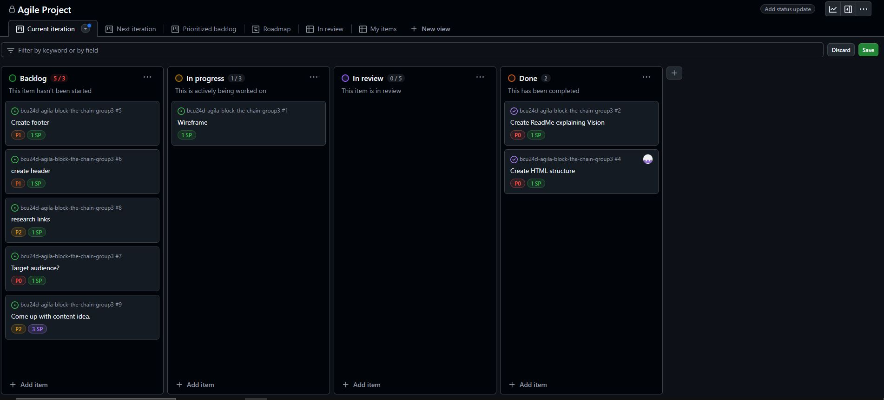

# Sprint planning - Sprint 1 (2024-11-18 to 2024-11-22)

## Backlog Tasks are not in chronological order. 
- **Task 1**: Create wireframe for the page (1 story points).
- **Task 2**: Have first daily standup (1 story points).
- **Task 4**: Create footer  (1 story points).
- **Task 5**: Create html structure (1 story points).
- **Task 6**: Create readME explaining vision (1 story points).
- **Task 7**: create header (1 story points).
- **Task 8**: research links (1 story points).
- **Task 9**: target audience (1 story points).
- **Task 8**: come up with content idea (3 story points).

## Roles
- Scrum Master: Ferenc
- Designer: Arwin
- Developer: EVERYBODY! 

## Screenshot

