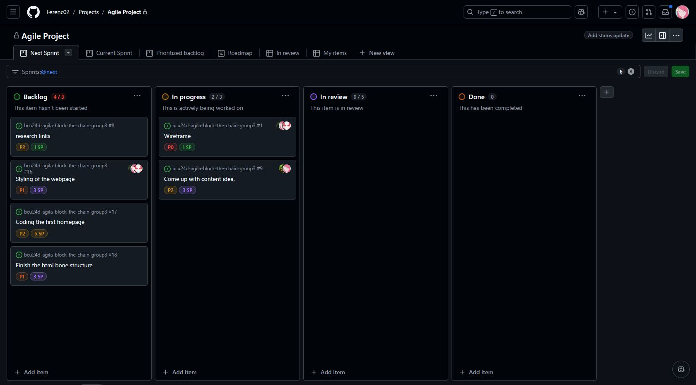

# Sprint planning - Sprint 1 (2024-11-23 to 2024-11-25)

## Backlog Tasks are not in chronological order. 
- **Task 1**: Create wireframe for the page (1 story points).
- **Task 2**: Research links (1 story points).
- **Task 3**: Come up with content idea (3 story points).
- **Task 4**: Styling of the webpage (3 story points).
- **Task 5**: Coding the first homepage (5 story points)
- **Task 6**: Finish the html bone structure (3 story points)

 ## Screenshot

