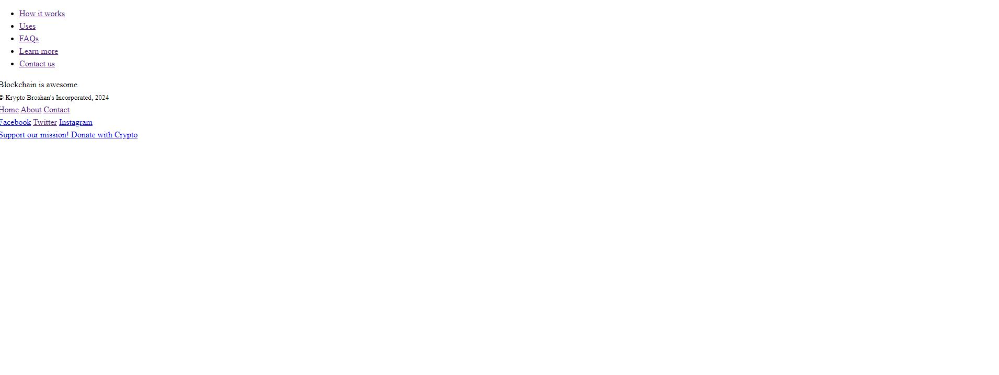
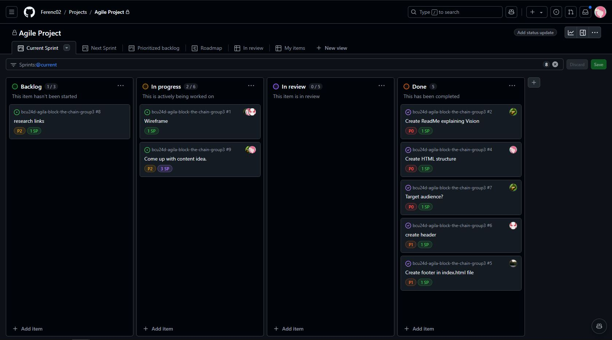

# Sprint Review - Sprint 1 (2024-11-22)

## What was Done?
- Started working on the wireframe, having a base foundation.
- Created a skeleton of the html.
- Created neccessary files for the project.
- We as a group has decided our target audiences and vision.
- Focused on creating semantic html

## Feedback from the Product Owner:
- Looking good as a start.
- More internal communication when pushing to github so the review can be faster to create less conflicts. 

## Next Steps:
- Focusing on the wireframe so it's done before beginning with the coding.
- Distribute parts to the teammates.

## Current Backlog Status:
- Tasks Completed:
- Create Readme explaining Vision
- Create HTML structure
- Decide on target audience.
- Create simple Header and Footer
  
- Tasks Not Completed:
- Finish the wireframe
- Content Idea
- Research Links

## Screenshots:

