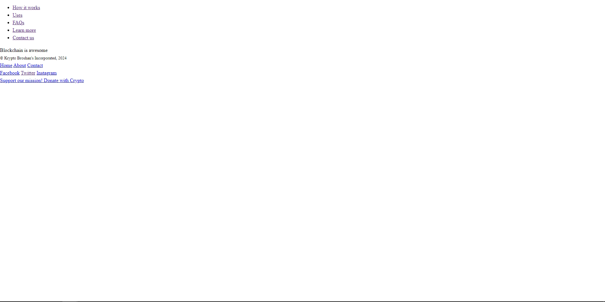
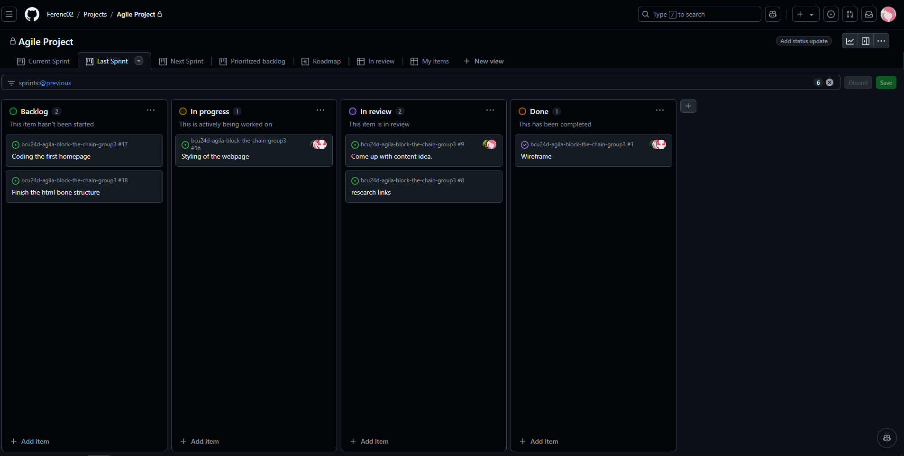

# Sprint Review - Sprint 2 (2024-11-25)

## What was Done?
- Wireframe
- Come up with content idea (Just some small polishing)
- Finding research links

## Feedback from the Product Owner:
- Great Job Team!

## Next Steps:
- Choosing a consistent styling, fonts, images and coloring. 
- Having all the text for the webpage (content)
- Assign the different parts for all group members so the coding can begin.

## Current Backlog Status:
- Tasks Completed:
- Wireframe
- Come up with Content Idea (Small polishing)
- Research links
  
- Tasks Not Completed:
- Styling of the webpage
- Coding the homepage
- Finish the html bone structure.

## Screenshots:

