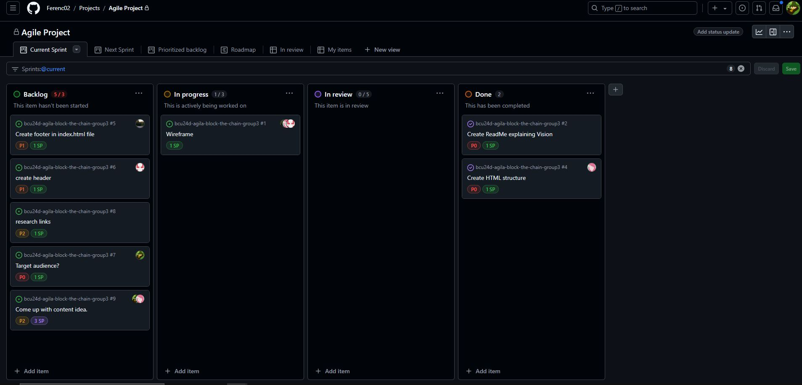

# Daily Stand-up 2024-11-21  

### **Ferenc**  
- **Done**: Finished the sprint structure so we can fill that in as the project moves forward.  
- **Doing**: Researching on the content that will be on our website.  
- **Problems**: No problemo.  

### **James**  
- **Done**: Have been exploring the world of GitHub, contemplating the correct way to formulate a footer so it has all parts included such as trademark/copyright. Possible trademark: CryptoBrothers.  
- **Doing**: Finishing the footer.  
- **Problems**: No issues completing the task he has been assigned.  

### **Arwin**  
- **Done**: Trying to explore GitHub and get a better understanding of branches/push/pull.  
- **Doing**: Adding header as a branch for our project and finishing the header until the next meeting.  
- **Problems**: Bunch of issues with pull/push but now gotten it resolved for the time being.  

### **Topias**  
- **Done**: I have assigned tasks to the team so everyone knows what is required of them this sprint.  
- **Doing**: I’m currently doing research on our content and nailing down our target audience.  
- **Problems**: Not much problems so far, learning slowly but steadily.  

  
